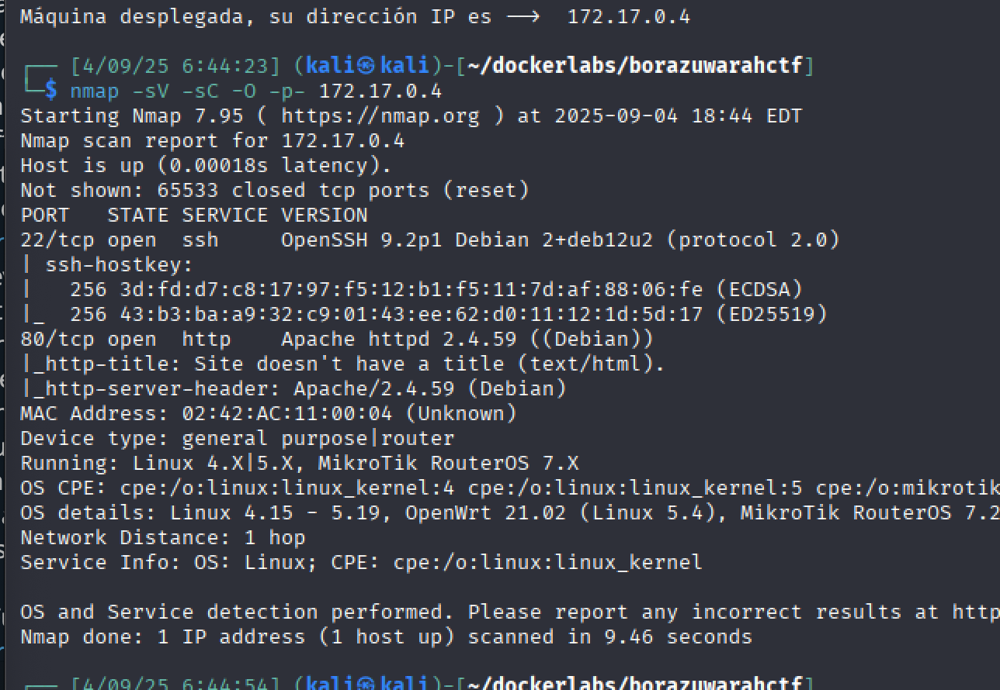
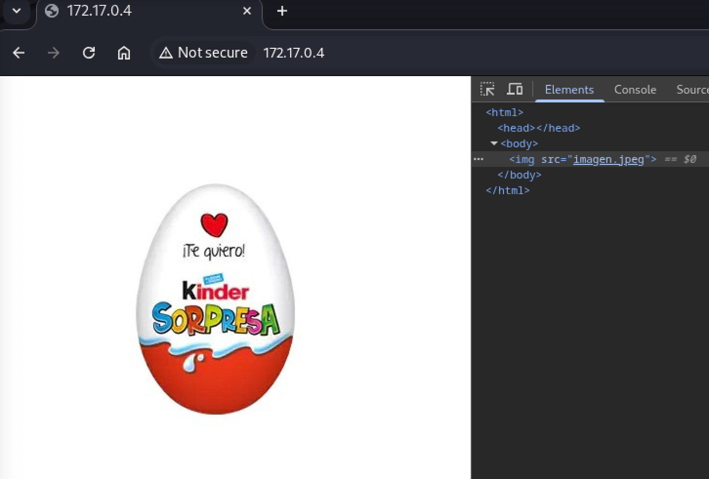
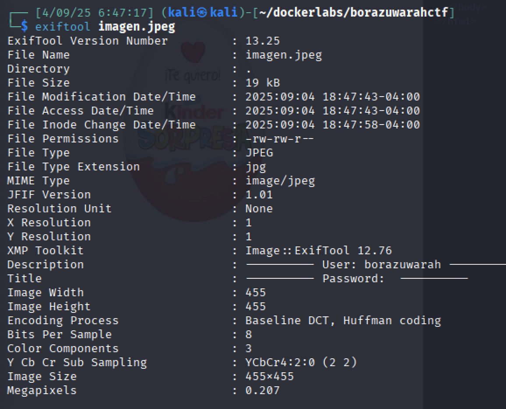
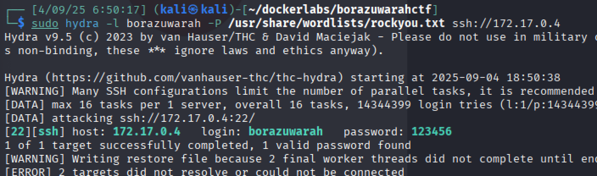
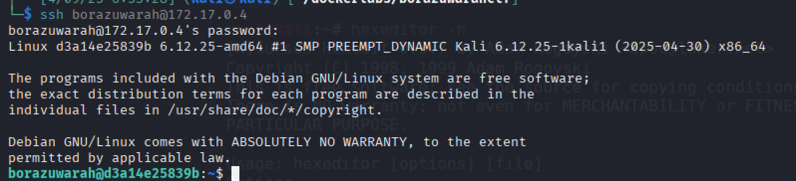
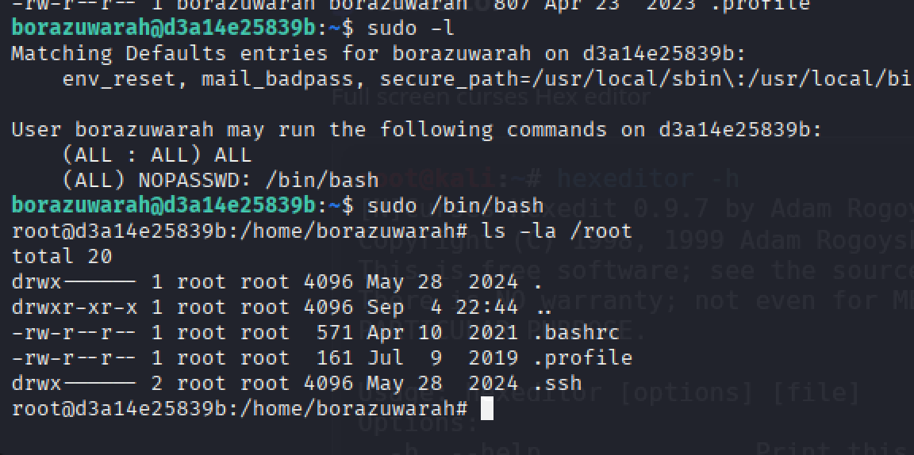

Enumeramos los puertos con nmap

Listamos con `dirb` los directorios del puerto 80

Si descargamos la imagen y miramos con `exiftool` los metadatos en contramos un usuario

Utilizamos hydra para encontrar la clave del usuario

Ingresamos mediante ssh

Con `sudo -l`podemos encontrar que tenemos permisos para ejecutar /bin/bash como root y sin password. 

