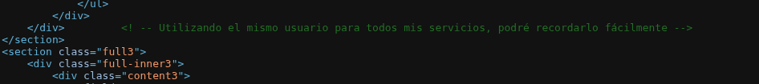
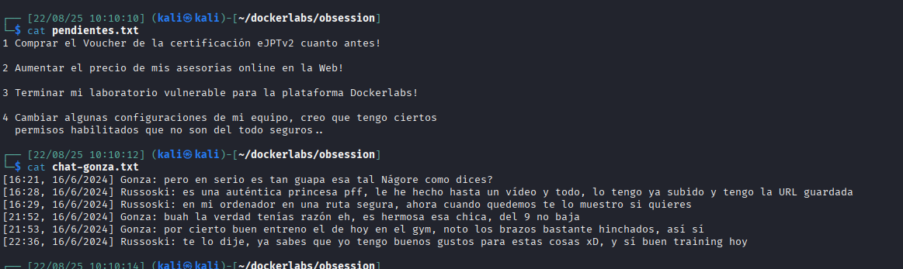

Escaneamos los puertos con nmap
```
nmap -sC -sV 172.17.0.2
```
<figure>

<figcaption></figcaption>
</figure>

Tenemos:
  - 21 FTP
  - 22 SSH
  - 80 HTTP

### HTTP
Abrimos con el navegador el sitio web 
<figure>

<figcaption></figcaption>
</figure>

Observamos el HTML del sitio web `ctrl + u`

Encontramos un comentario:
<figure>

<figcaption></figcaption>
</figure>

Un formulario
<figure>

<figcaption></figcaption>
</figure>

Al hacer submit en el formulario vemos este mensaje:
<figure>

<figcaption></figcaption>
</figure>

La petición fue a la siguiente dirección con los parámetros que se observan
```
http://172.17.0.2/.formrellyrespexit.html?nombre=qwe&apellido=qwe&telefono=qwe&email=qwe%40qweqwe.c&somatotipo=Endomorfo&llamada+a+la+accion=CAMBIAR+MI+VIDA+A+MEJOR+AHORA&campaign=BLACKFRIDAY
```

Usando dirb encontramos algunos directorios
<figure>

<figcaption></figcaption>
</figure>

En /important solo encontramos el manifiesto hacker

<figure>

<figcaption></figcaption>
</figure>

Navegamos en el directorio backup y vemos un enlace a un archivo txt
<figure>

<figcaption></figcaption>
</figure>

En backup.txt obtenemos un usuario
<figure>

<figcaption></figcaption>
</figure>

### FTP
pero probamos anonymous en ftp
<figure>

<figcaption></figcaption>
</figure>

hacemos get de los archivos
<figure>

<figcaption></figcaption>
</figure>

### SSH
Con rockyou y el usuario `russoski`, probamos fuerza bruta usando `hydra`. Encontramos la clave.
<figure>

<figcaption></figcaption>
</figure>

Accedemos por ssh
<figure>

<figcaption></figcaption>
</figure>

Usamos `sudo -l` para observar si tenemos permisos para ejecutar sudo de alguna manera. Tenemos acceso a vim sin contraseña.
<figure>

<figcaption></figcaption>
</figure>

Escalamos privilegios
`sudo vim -c ':!/bin/sh'`
<figure>

<figcaption></figcaption>
</figure>

Obtuvimos acceso con root
<figure>

<figcaption></figcaption>
</figure>

Listamos /root
<figure>

<figcaption></figcaption>
</figure>