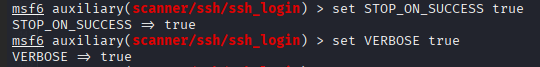
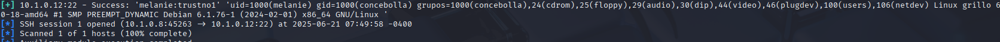
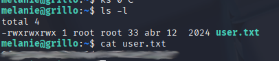
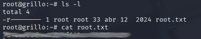

Para comenzar, escaneamos la red 10.1.0.0 donde se encuentra nuestra victima para obtener su IP
<figure>

<figcaption></figcaption>
</figure>

Observamos que la IP es 10.1.0.12
<figure>

<figcaption></figcaption>
</figure>

Ejecutamos nmap sobre 10.1.0.12 para determinar qué puertos y servicios posee
<figure>

<figcaption></figcaption>
</figure>

Observamos que tiene los puertos SSH(22) y HTTP(80) abiertos
<figure>

<figcaption></figcaption>
</figure>


Parece que tiene apache2
<figure>

<figcaption></figcaption>
</figure>

A pesar que parece la página por defecto, al final del HTML encontramos un mensaje
```
cambia la contraseña de ssh por favor melanie
```
<figure>

<figcaption></figcaption>
</figure>

Será que podemos aplicar fuerza bruta con ssh utilizando el usuario melanie?
Para esto podemos usar el diccionario `/usr/share/wordlists/rockyou.txt`
Con ssh_login en msfconsole
<figure>

<figcaption></figcaption>
</figure>

Configuramos el RHOST con la IP víctima y usuario `melanie`. También definimos el diccionario.
<figure>

<figcaption></figcaption>
</figure>
Lo ponemos en modo verbose y cuando encuentre una coincidencia es suficiente para ello modificamos `STOP_ON_SUCCESS` a `true`
<figure>

<figcaption></figcaption>
</figure>

Como vemos, el usuario `melanie` tiene una clave dentro del diccionario de rockyou `trustno1`
<figure>

<figcaption></figcaption>
</figure>

En el home del usuario está la primera flag del archivo `user.txt`
<figure>

<figcaption></figcaption>
</figure>

Observamos con el usuario `sudo -l` qué podemos ejecutar sin password y como sudo. El comando `puttygen` puede ser ejecutado
<figure>

<figcaption></figcaption>
</figure>
Con este comando podemos leer y crear claves para usar en putty (o ssh). Podemos crear una llave SSH y con `puttygen` enviar el resultado de la llave publica a authorized_keys del usuario root.


<figure>

<figcaption></figcaption>
</figure>

Ahora con puttygen leemos la clave publica para determinar como salida `/root/.ssh/authorized_keys`
<figure>

<figcaption></figcaption>
</figure>
Una vez que la tenemos agregada podemos usar la llave privada para iniciar sesión
<figure>

<figcaption></figcaption>
</figure>
Listamos en el directorio `/root` y obtenemos la flag `root.txt`
<figure>

<figcaption></figcaption>
</figure>

También se podría haber generado en el atacante o llevarnos la llave al atacante
<figure>

<figcaption></figcaption>
</figure>