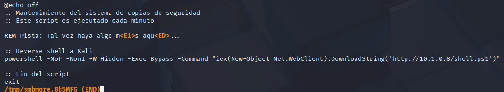
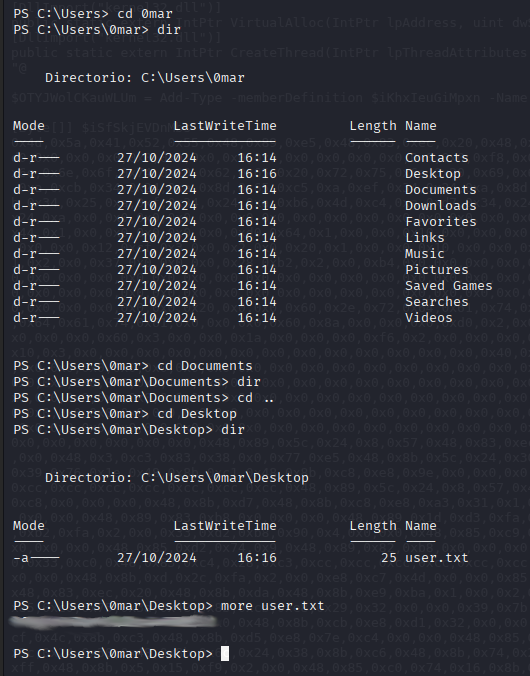
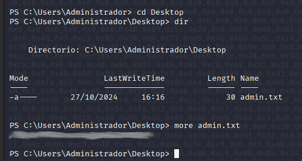

Usamos el netdiscover para ver las IPs de nuestro segmento de red
<figure>

<figcaption></figcaption>
</figure>

<figure>

<figcaption></figcaption>
</figure>
<figure>

<figcaption></figcaption>
</figure>
<figure>

<figcaption></figcaption>
</figure>
Podemos observar que nmap descubrió el dominio WORKGROUP en nuestro objetivo y es un Windows Server 2016 (14393) a través del script smb-os-discovery. Tambien observamos que el usuario guest es soportado. Probemos acceder con el usuario invitado mediante el comando smbmap
<figure>

<figcaption></figcaption>
</figure>

Vemos que tenemos `Compartido`, accedemos mediante smbclient
<figure>

<figcaption></figcaption>
</figure>

Navegando a `Proyectos\Quokka\Código` encontramos algunos archivos

<figure>

<figcaption></figcaption>
</figure>

Bajamos los archivos con `mget *`:
<figure>

<figcaption></figcaption>
</figure>

El html no tiene nada
<figure>

<figcaption></figcaption>
</figure>

Hay un .bat
<figure>

<figcaption></figcaption>
</figure>

Y otro `mantenimiento - copia.bat` que contiene lo siguiente
<figure>

<figcaption></figcaption>
</figure>

Intentemos cambiar la ip destino de la revshell
<figure>

<figcaption></figcaption>
</figure>

Ahora lo subimos con put
<figure>

<figcaption></figcaption>
</figure>

Con el comando more revisamos
<figure>

<figcaption></figcaption>
</figure>

Verificamos que apache esté corriendo
<figure>

<figcaption></figcaption>
</figure>

Creamos el shell.ps1 y lo copiamos a la carpeta de apache
<figure>

<figcaption></figcaption>
</figure>

Con msfconsole preparamos una revshell
<figure>

<figcaption></figcaption>
</figure>
<figure>

<figcaption></figcaption>
</figure>
Esperamos como máximo 1 minuto que es lo que tarda en ejecutar mantenimiento.bat y ya tenemos la sesión
<figure>

<figcaption></figcaption>
</figure>

Estamos como administrador
<figure>

<figcaption></figcaption>
</figure>

Vemos que en el usuario 0mar tenemos el archivo user.txt
<figure>

<figcaption></figcaption>
</figure>

Y como somos administrador, podemos ver el desktop también de este usuario. Obtenemos admin.txt
<figure>

<figcaption></figcaption>
</figure>
